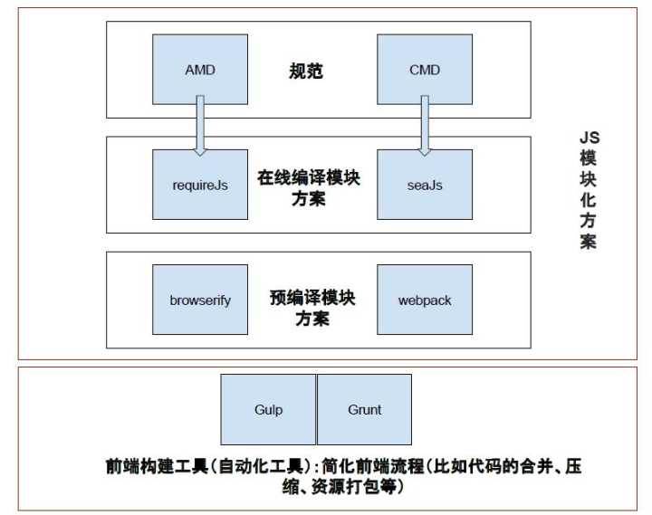

构建前端工作流
==============

## Gulp/Grunt是一种能够优化前端的开发流程的工具

### gulp问题集锦

- Gulp's API
    - gulp.src
	- gulp.dest
	- gulp.task
	- gulp.watch

## WebPack是一种模块化的解决

### webpack问题集锦

## 使用 mock.js 让前端开发与后端独立

- 基于数据模板生成数据。
- 基于HTML模板生成数据。
- 拦截并模拟Ajax请求。

### mock 常用方法

- [mockjs官方文档](https://github.com/nuysoft/Mock/wiki)

